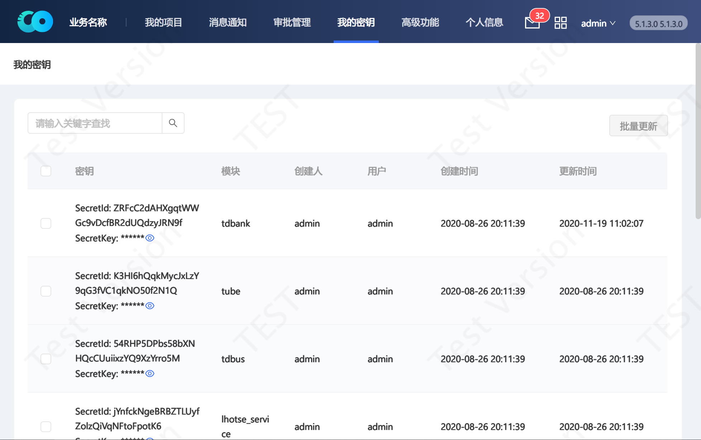

# accessKey

## 介绍

套件portal提供主要的resful api都经过单点登录认证，保证用户通过浏览器访问调用portal接口的时候进行过单点登录操作。如果想使用代码进行接口调用就要自己做模拟登陆后才可以进行使用，增加了客户端代码的使用难度。因此我们开发了另一套可以基于accesskey认证的方式调用portal api的方案。

## 获取API授权Key
要获取API授权key，需要首先获取用户的secureId和secureKey。有多种方法可以获取用户的secureId和secureKey。

**1\) 通过Portal界面：**

 登陆Portal，进入 个人信息->我的密钥，如下图：


**2\) 通过数据库：**

1、登陆Portal DB，使用TBDS数据库 `mysql -uroot -ppassword -Dtbds`。
2、查看用户 user_01 的认证信息 `select * from tbds_access_key where user_name= 'user_01' and module = 'ALL';`。

**3\) 通过tbds运维工具：**

1、登录Portal节点机器，切换到目录：`/data/tools`。
2、执行命令`./tbds-cli.sh getkey --help`，参考getkey命令说明传入参数即可。

```shell
# 切换到目录/data/tools
[root@tbds-10-1-0-126 tools]#

# tbds-cli.sh 说明
[root@tbds-10-1-0-126 tools]# ./tbds-cli.sh getkey --help
usage: tbdscli getkey module username
module       - <hadoop|hbase>
username     - <hdfs|hbase>
e.g.: tbdscli getkey hadoop hdfs
      tbdscli getkey hbase hbase

# 例如获取账户admin的hadoop模块secureId和secureKey
[root@tbds-10-1-0-126 tools]# ./tbds-cli.sh getkey hadoop admin
id: 0B73KaKpYXx7rG8DDGruS63sNMdPvMzEwL55
key: ENBa4MDBkH1THJYo9MNYYSy260bIjYu6
```

<!-- markdownlint-disable MD033 -->
获取到用户的secureId和secureKey后，就可以通过下面的Python脚本生成访问API的授权key。
保存附件<a href="./get-access-key.zip" target="_blank">get-access-key.zip</a>到本地目录，解压后可以看到两个文件，一个是生成API授权key的python脚本get_access_key.py，一个是配置secureId和secureKey的json配置文件tbds.api.json，编辑tbds.api.json将查询到的用户的secureId和secureKey配置好后，运行`python get_access_key.py`的返回结果AccessKey字段的值即为API授权key。

```shell
[root@tbds-10-1-0-126 get-access-key]# cat tbds.api.json
{
    "secure_id": "xPuMVjpi7NuTtE6ffG275OUPjQGxxxxxxxxxx",
    "secure_key": "1bfJBFTxQg9184GpPlu5gP1r6Pxxxxxxxx"
}
[root@tbds-10-1-0-126 get-access-key]# python get_access_key.py
{
    "AccessKey": "TBDS xPuMVjpi7NuTtE6ffG275OUPjQGxwWvBDA4a 1606443945585 3 NtGiQn2MnhgoGgdWLHgbcnaZCKQ%3D"
}
```

## 根据秘钥调用API
接口采用GET或者POST使用方式，具体参考各个功能接口说明，在api调用时需要在header中添加对应用户的访问密钥。

<!-- markdownlint-disable MD034 -->
例如对于调用任务调度api接口提供以下两种调用方式:
1. 外网访问方式: `https://{portal节点外网ip}:8080/tdw/guldan/{各接口的接口地址}`。
2. 内网访问方式: `http://{GuldanGateway节点ip}:9067/{各接口的接口地址}`。

在调用任务调度api接口时，需要在header中设置用户的访问密匙，比如获取任务详情:

```shell
# 外网IP和端口
curl --header 'Authorization:TBDS aCegO7rs1rTLpuNfWSLMzS0NAdYbxLXWmGut 1521001832925 48 4WdIgY7V%2F009lnJnz1iHNjobX5w%3D' 'https://{portal节点外网ip}:8080/tdw/guldan/tbds/inner/service/task/info?taskId=20200730165051614'

# 内网IP和端口
curl --header 'Authorization:TBDS aCegO7rs1rTLpuNfWSLMzS0NAdYbxLXWmGut 1521001832925 48 4WdIgY7V%2F009lnJnz1iHNjobX5w%3D' 'http://{Guldan Gateway ip}:9067/tbds/inner/service/task/info?taskId=20200730165051614'
```

> 注意事项1：如果header未包含Authorization则会报407错误。
>
> 注意事项2：接口会话超时时间默认10分钟，如果超时需要重新申请api访问密钥，会话超时会提示以下信> 息：
>
> ```json
> {
>     "timestamp": 1521005199665,
>     "status": 500,
>     "error": "Internal Server Error",
>     "exception": "java.lang.RuntimeException",
>     "message": "Invalid TBDS authenticationtoken. The session is timeout",
>     "path": "/api/dataexploit/flow/list"
> }
> ```
>
> 在tbds-portal服务配置文件中可以查看和修改。
> 配置文件为：`/usr/local/tbds-portal/conf/> stom.properties`。
> 配置项为`tbds.authentication.session.timeout`。
> 如果超时需要重新申请api访问密钥。

## 生成认证header的java示例代码

调用：getAccessAuthHeader获取

```java
package utils;

import com.alibaba.fastjson.JSON;
import com.alibaba.fastjson.JSONObject;

import org.apache.commons.codec.binary.Base64;
import org.apache.commons.codec.digest.HmacUtils;

import pojo.AccessKey;

import java.io.UnsupportedEncodingException;

import java.net.URLEncoder;

import java.util.Date;
import java.util.Random;


public class AccessUtils {
    public static String getAccessAuthHeader(String secureId, String accessKey) throws Exception {
        System.out.println("access info=" + accessKey.toString());

        Long timestamp = new Date().getTime();
        Integer nonce = new Random().nextInt(10 * 8) + 1;
        String signature = AccessUtils.generateSignature(accessKey.getSecureId(),
                timestamp, nonce, accessKey.getSecureKey());
        String accessHeader = "TBDS " + accessKey.getSecureId() + " " +
            timestamp + " " + nonce + " " + signature;
        System.out.println("access encode=" + accessHeader);

        return accessHeader;
    }

    private static AccessKey getAccessKeyByRequestContent(String content) {
        JSONObject object = JSONObject.parseObject(content);

        if ("0".equals(object.getString("resultCode"))) { //操作成功
            return JSON.parseObject(object.getString("resultData"), AccessKey.class);
        } else { //操作失败
            System.out.println(object.getString("message")); //获取失败信息
            return null;
        }
    }

    private static String generateSignature(String secureId, String secureKey,
        long timestamp, int randomValue) {
        Base64 base64 = new Base64();
        byte[] baseStr = base64.encode(
            HmacUtils.hmacSha1(secureKey, secureId + timestamp + randomValue)
        );
        String result = "";

        try {
            result = URLEncoder.encode(new String(baseStr), "UTF-8");
        } catch (UnsupportedEncodingException e) {
            e.printStackTrace();
        }

        return result;
    }
}
```

## 生成认证header的python示例代码

```python
#!/usr/bin/env python

import hmac
import time
import random
import base64
import urllib
import os
import json

from hashlib import sha1


def get_config(pth=None):
    if not pth:
        pth = os.path.join(os.getcwd(), 'tbds.api.json')
    if not os.path.exists(pth):
        raise OSError("Config file doesn't exist!")
    else:
        with open(pth, 'r') as fp:
            return json.load(fp)


def get_timestamp():
    return int(time.time() * 1000)


def get_access_key(sec_key, sec_id):
    nonce = str(random.randint(1, 100))
    ts = str(get_timestamp())
    raw = ''.join([sec_id, ts, nonce])
    hashed = hmac.new(sec_key, raw, sha1).digest()
    signature = urllib.quote_plus(base64.b64encode(hashed).encode('utf-8'))
    access_key = "TBDS {0} {1} {2} {3}".format(sec_id, ts, nonce, signature)
    return access_key


def main():
    config = get_config()
    sec_id = config['secure_id']
    sec_key = config['secure_key']
    access_key = get_access_key(str(sec_key), str(sec_id))
    print json.dumps({'AccessKey': access_key}, indent=4, sort_keys=True)


if __name__ == '__main__':
    main()
```
